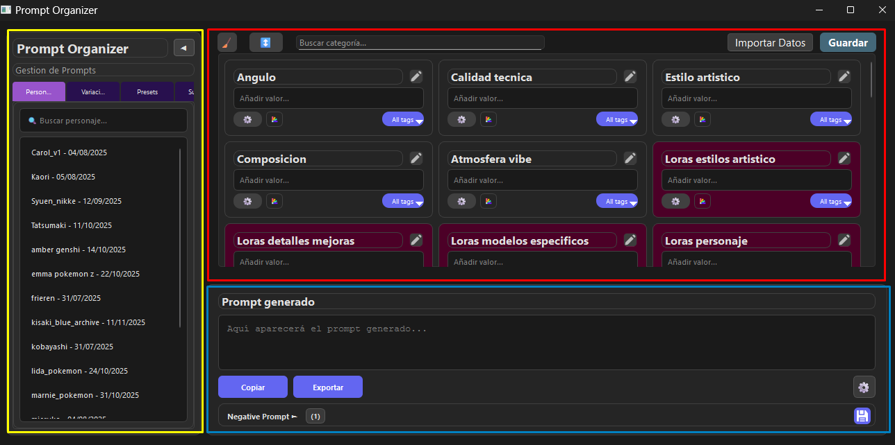
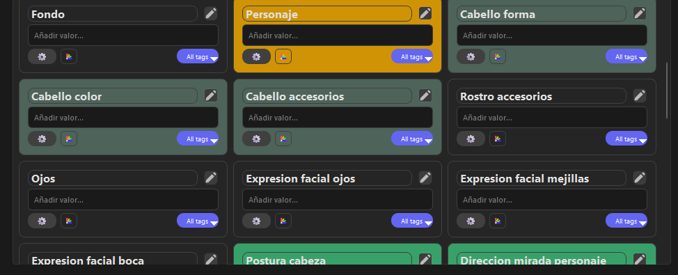

# Gestor de Prompts para imagenes

Generador/organizador de prompts, diseñado específicamente para la generación de imágenes.

## Características Principales

### Interfaz de Usuario
- **Layout de tres secciones**: Sidebar izquierda, grid de categorías superior, y sección de prompt inferior



- **Grid responsivo** con scroll vertical para las categorías

- **40+ categorías organizadas** en tarjetas individuales
- **Tags visuales** para valores comunes en cada categoría

### Generación de Prompts
- **Combinación automática** de todas las categorías activas
- **Eliminación de duplicados** automática
- **Orden logico General** →Calidad y estilo(tecnica) → Rasgos Fisicos→ vestuarios→ Poses → Expresiones → Complementos(loras/LyCORIS/StyleReferences)


- **Validación de inputs** y limpieza automática

### PromptCapture
Sistema inteligente de clasificación de prompts mediante Embeddings e IA Local.
- **Análisis Semántico**: Entiende el contexto de tus tags (ej. sabe que "red dress" es Vestuario y "blue eyes" es Rasgo Físico).
- **Clasificación Automática**: Pega un prompt largo o desordenado y el sistema lo distribuirá automáticamente en las tarjetas correspondientes.
- **Privacidad Local**: Utiliza el modelo `bge-large-en` optimizado para correr 100% en tu equipo sin necesidad de internet y sin censura.

### Gestión de Datos
- **Persistencia local** de configuraciones y datos
- **Historial de prompts** con límite configurable
- **Exportación** en formatos JSON y TXT
- **Gestión de personajes y escenas** con descripciones


## Requisitos del Sistema

### Software
- Python 3.8 o superior
- PyQt6==6.9.1
- Pillow (PIL)
- pyperclip


## 🛠️ Guía de Instalación (Para Principiantes)

Sigue estos pasos si estás instalando la aplicación desde cero en Windows.

### 1. Instalar Python
Necesitas Python 3.10 o superior.
1. Ve a [python.org/downloads](https://www.python.org/downloads/).
2. Descarga e instala la última versión.
3. **MUY IMPORTANTE**: En el instalador, marca la casilla **"Add Python to PATH"** antes de dar clic en Install.

### 2. Descargar el Código
1. Descarga este repositorio (botón verde "Code" -> "Download ZIP") y descomprímelo.
2. Abre la carpeta descomprimida.
3. Haz clic derecho en un espacio vacío de la carpeta y selecciona "Abrir en Terminal" (o abre CMD y navega a la carpeta).

### 3. Crear Entorno Virtual (Recomendado)
Para mantener tu sistema limpio, crearemos un entorno aislado:

```bash
python -m venv appPrompt
```

### 4. Activar el Entorno
Activa el entorno para empezar a trabajar en él:

```bash
appPrompt\Scripts\activate
```
*(Deberías ver `(appPrompt)` al principio de tu línea de comandos)*.

### 5. Instalar Dependencias
Instala todas las librerías necesarias (Interfaz, IA, herramientas) automáticamente:

```bash
pip install -r requirements.txt
```
*Nota: La primera vez puede tardar unos minutos ya que descargará librerías de IA como PyTorch y SentenceTransformers.*

### 6. Ejecutar la Aplicación
Una vez instalado todo, inicia el programa con:

```bash
python main.py
```


## Uso de la Aplicación

### Interfaz Principal
1. **Sidebar izquierda**: Selecciona personajes y escenas predefinidas
2. **Grid de categorías**: Completa los campos para generar tu prompt
3. **Sección de prompt**: Visualiza el resultado en tiempo real

### Generando Prompts
1. **Selecciona categorías**: Haz clic en los inputs de las categorías que desees usar
2. **Escribe valores**: Ingresa términos específicos o usa los tags sugeridos
3. **Observa en tiempo real**: El prompt se actualiza automáticamente
4. **Ajusta el negative prompt**: Expande la sección para personalizar

## 📁 Estructura del Proyecto

```
AppPrompts/
│---appPrompt               # carpeta del entorno virtual del proyecto
│   └── activate.bat        # Activación del entorno virtual
├── main.py                 # Punto de entrada de la aplicación
├── requirements.txt        # Lista de dependencias
├── ui/                     # Componentes de interfaz
│   ├── main_window.py      # Ventana principal
│   ├── sidebar.py          # Panel lateral
│   ├── category_grid.py    # Grid de categorías
│   ├── prompt_section.py   # Sección de prompt
│   ├── ui_elements.py      # Elementos UI personalizados
│   └── embeddings/         # Motor de IA (PromptCapture)
├── logic/                 
│   └── prompt_generator.py # Generador de prompts
├── config/                 # Configuración
│   └── settings.py         # Gestión de datos y configuraciones
├── data/                   # Datos persistentes 
│   ├── settings.json       # Configuraciones de la app
│   ├── characters          # Personajes guardados
│   ├── categories.json     # Escenas guardadas
│   └── tags.json           # Historial de prompts
└── assets/                 # Recursos (iconos, imágenes)
```

## Reportar Problemas

Si encuentras algún problema o tienes una sugerencia, por favor:

1. Revisa los issues existentes
2. Crea un nuevo issue con:
   - Descripción detallada del problema
   - Pasos para reproducir
   - Información del sistema
   - Capturas de pantalla (si aplica)


---

